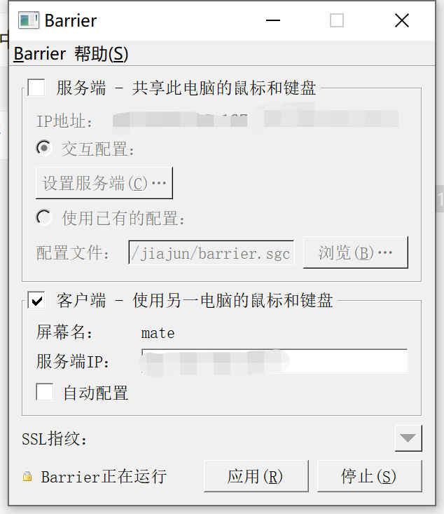
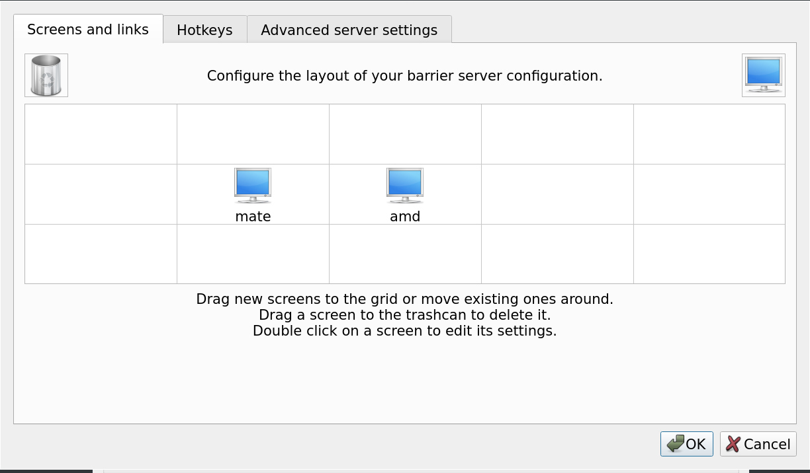

# 使用软KVM切换器 barrier 共享键鼠

我一直用 Linux 办公，之前都是 Linux host + Windows 虚拟机的方案，但是换
AMD + 4k显示器之后，虚拟机不知道是啥原因，卡得慌，于是把老本本搬出来放
一边用于开会等。

笔记本自然是有一套键盘 + 触控板，触控板摸多了手指指腹会不舒服，所以我
还弄了一个鼠标，这就导致有两套键鼠，每天左边右边转来转去，实属有点难受。

示意图如下：

```
+------------------------------------------------+
|                                                |
|    +--------+               +--------------+   |
|    | 笔记本 |               | 台式机显示器 |   |
|    +--------+               +--------------+   |
|         |                          |           |
| 自带键盘 + 外接鼠标        外接键盘 + 外接鼠标 |
|                                                |
+------------------------------------------------+
                                |
                                |
                                我
```

考虑过买KVM切换器，但是看起来每一次都要按一下，有点麻烦，并且都是 VGA 接口，显示器不支持。

偶然在群里看到群友同时共用n台电脑，询问后发现是使用的 [synergy](https://github.com/symless/synergy-core)
方案，于是我也去搜索了一下，发现这个软件现在开始要求付费使用，当然也可以自己
编译，但是搜索之后，我发现有一个替代软件 [barrier](https://github.com/debauchee/barrier)，
后者是从前者fork出来的源码，现在星星比前者还多了。

## 安装

我是 Linux 作为server，加上 Windows 作为client使用。绝大部分的Linux都已经包含了
barrier 这个软件包，虽然可能稍微老了点，但是问题不大：

```bash
$ sudo apt install barrier
$
```

Windows 直接去 [release 页面](https://github.com/debauchee/barrier/releases) 下载最新版本安装即可。

## 配置

首先打开 Windows 端，很简单，选择客户端，如果不想指定IP地址的话，就直接选择 自动配置，记住屏幕名是什么，如下：



然后打开 Linux 端，可以直接 barrier 启动，点击服务端，然后点击 "设置服务器"，
点击弹窗中的右上角的图标，加一个显示器，名字就命名为刚才 Windows 机器的 "屏幕名"，然后在方格中摆好位置，如下：



> 如果开了防火墙，记得打开 24800 端口，这是 barrier 默认监听端口

此时，回到 Windows 机器，点击 "开始"，这个时候应该就可以使用了，如果不能使用的话，点击菜单中的 "显示日志"，来查看为啥不能用。

## 自启动

为了能自动启动Linux和Windows中的服务端和客户端，需要分别设置。

首先，Linux中，菜单中点击，配置另存为，然后保存为一个文件，把配置文件保存到
`~/.config/barrier/config` 里，当然也可以另外找一个路径，我是保存在这里的。
然后编辑 systemd service 文件 `~/.config/systemd/user/barriers.service`：

```systemd
# Copyright 2017-2018, Adrian Lucrèce Céleste and the config contributors
# SPDX-License-Identifier: GPL-2.0+
[Unit]
Description=Barrier keyboard & mouse sharing software (Server)
After=network.target

[Service]
PassEnvironment=DISPLAY
ExecStart=/usr/bin/barriers --address 监听的IP地址 --enable-crypto --no-restart --no-daemon --config %h/.config/barrier/config
Type=simple
ProtectHome=read-only
ProtectSystem=true
PrivateTmp=true
Restart=always
RestartSec=10

[Install]
WantedBy=alc.target
```

Windows 中自启动，需要先以管理员身份打开软件，然后菜单中点击设置，
勾选 "开机自启"，然后就可以重启试试，我实测有一个小bug ，就是不管
勾不勾选 "最小化到系统托盘" 右下角都看不到，不过没关系，软件能正常工作。

完美，免费开源的KVM切换系统就此达成，实测体验还是不错的，当然，由于使用
的是网络通信，也就是说如果网络不好，那么就会一卡一卡，所以这一点需要
注意，我的建议是，能用网线的都用网线。

---

Ref:

- https://github.com/AdrianKoshka/config/wiki/My-barrier-setup
- https://wiki.archlinux.org/title/Barrier
