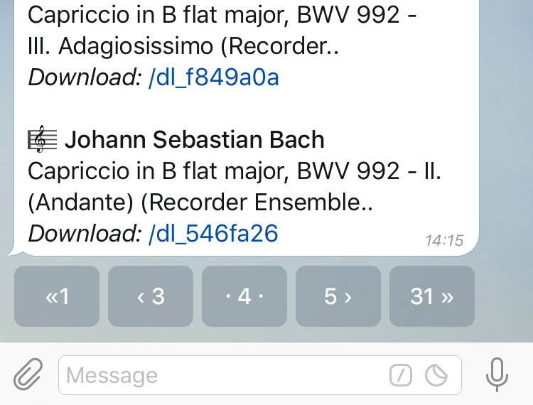

# 使用 HTTP Router 处理 Telegram Bot 按钮回调

写 Telegram Bot 的时候，我们可能会选择使用 [Inline keyboard](https://core.telegram.org/bots/2-0-intro#new-inline-keyboards)，
这样的好处是界面比较好看，交互也好，消息下面可以有很多按钮，点击一下就可以更新消息和按钮，但是开发起来就比较麻烦，
因为每一个点击，对于 Telegram Bot 程序来说，都是要处理一个回调，而且大部分情况下按钮是需要带一定的消息回去的。

比如分页按钮，用户点了数字为 `3` 的按钮，在回调的时候，就需要知道用户是点击的 `3` 的按钮，从而展示第三页的内容。
通常我们都是把回调信息放到 [callback_data](https://core.telegram.org/bots/api#inlinekeyboardmarkup) 里，从定义可以看到，
`callback_data` 是一个字符串，最长64个字符，最短1个，如果不填写的话，就不会触发 callback 的操作（点击按钮也就没有响应）。



如果只有一两个按钮，那么处理起来就会很简单，在处理回调的地方，写一堆的 `if...else...` 或者是用一个 `map[string]Func` 来
保存 `callback_data` 和具体逻辑的关系就可以，但是当按钮多了以后，我们就需要一种更好的方式来切分回调函数的处理逻辑，因此，
我就把 [httprouter](https://github.com/julienschmidt/httprouter) 引入到 Telegram Bot 的开发中。

## httprouter

httprouter 是一个HTTP用的路由框架，它底层的原理是把每一个 `handler` 挂载到 `radix tree` 的节点上，当我们有一个 HTTP 请求到来
时，它就根据 URL 去 `radix tree` 上查找，找到对应的 `handler` 然后执行：

```
Priority   Path             Handle
9          \                *<1>
3          ├s               nil
2          |├earch\         *<2>
1          |└upport\        *<3>
2          ├blog\           *<4>
1          |    └:post      nil
1          |         └\     *<5>
2          ├about-us\       *<6>
1          |        └team\  *<7>
1          └contact\        *<8>
```

它的用法就像是这样：

```go
func Index(w http.ResponseWriter, r *http.Request, _ httprouter.Params) {
	fmt.Fprint(w, "Not protected!\n")
}

func main() {
	router := httprouter.New()
	router.GET("/", Index)

	log.Fatal(http.ListenAndServe(":8080", router))
}
```

具体原理可以参考我的这篇 [httprouter源码分析](https://jiajunhuang.com/articles/2020_05_09-httprouter.md.html)。

## 结合 Telegram Bot

我使用的 Telegram Bot 框架是 [telebot](https://github.com/tucnak/telebot)，这个框架想要处理回调，就得注册这么一个函数：

```go
b	bot, err = tb.NewBot(tb.Settings{}) // ...

bot.Handle(tb.OnCallback, HandleCallback)

func HandleCallback(c tb.Context) error {
	callback := c.Callback()
	logger.Info("received callback", zap.Any("callback_data", callback.Data))

    // 处理回调

	return nil
}
```

如果有多个按钮需要处理回调，例如分页按钮，可能展示了 `1-10项`，而且很有可能是动态的，比如点击到第2页的时候，还要把
`10-20项` 展示出来，那就不好在 `HandleCallback` 中分别 `if...else...` 方式处理了，那样很麻烦，那有没有更好的方案呢？

我们平时写 HTTP 服务的时候，通常 HTTP 请求，我们可以在四个地方传参数：

- URL本身，例如 RESTful 中的 `/groups/1/users/1/`
- Query String，例如 `?user=1&page=2&offset=3`
- Header，例如 `Authorization: Bearer blablabla`
- Payload，也就是请求的Body，例如传一个JSON或者XML

但是 Telegram Bot 的回调没有这么强大，这也是我一直觉得 Telegram Bot 的表达能力不足的原因之一，由于 `callback_data` 是一个最长
64字节的字符串，我们只能考虑放 `URL` 和 `Query String`，而且由于 `Query String` 一般都是 `?a=b&c=d` 的形式，会浪费不少
空间，因此我就只考虑 `URL` 了，那么很自然，可以考虑使用 `httprouter` 来做分发，并且把参数放到 `URL` 里面。

因此，最后的使用就会变的像这样，首先在 `main` 函数里注册路由：

```go
router.Handle("/users/list/page/:page", CallbackGetUsersByPage)
```

然后定义这个函数的逻辑：

```go
func CallbackGetUsersByPage(c tb.Context, params router.Params) {
    // ...
}
```

接下来就是具体的代码逻辑了，想要取参数，可以直接在 `params` 里获取。

当然，具体源码我就没有贴出来了，思路已经展示完毕，如果有需要的话，可以自己整一个。

## 总结

由于 Telegram Bot 回调按钮的表达力偏弱，当有很多回调按钮时，我们就需要有一个合理的框架能够帮我们做到逻辑拆分，因此我
结合了 httprouter 来完成这个目标。此后就可以通过注册路由，然后把不同路由的逻辑处理放到不同的函数里，并且可以实现传参
等功能。
