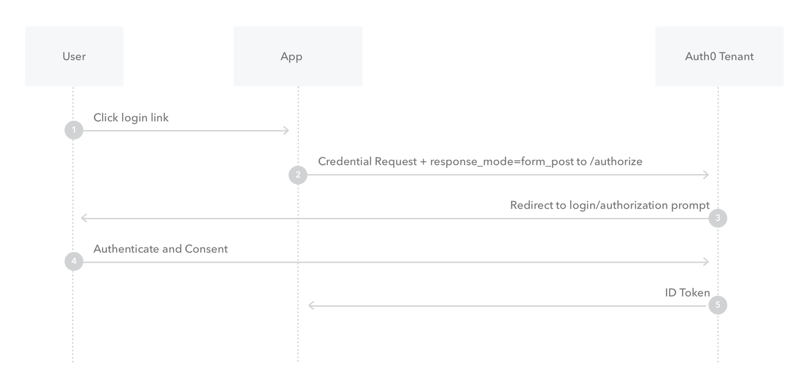

# OAuth 2 详解（二）：Implict Grant Flow

在 [RFC6749](https://www.rfc-editor.org/rfc/rfc6749#section-4.2) 中，Implict Grant Flow的流程图比较复杂：

```
+----------+
| Resource |
|  Owner   |
|          |
+----------+
     ^
     |
    (B)
+----|-----+          Client Identifier     +---------------+
|         -+----(A)-- & Redirection URI --->|               |
|  User-   |                                | Authorization |
|  Agent  -|----(B)-- User authenticates -->|     Server    |
|          |                                |               |
|          |<---(C)--- Redirection URI ----<|               |
|          |          with Access Token     +---------------+
|          |            in Fragment
|          |                                +---------------+
|          |----(D)--- Redirection URI ---->|   Web-Hosted  |
|          |          without Fragment      |     Client    |
|          |                                |    Resource   |
|     (F)  |<---(E)------- Script ---------<|               |
|          |                                +---------------+
+-|--------+
  |    |
 (A)  (G) Access Token
  |    |
  ^    v
+---------+
|         |
|  Client |
|         |
+---------+
```

但是实际应用中，我们通常只会采用 ABCG 四步，省略DEF。Implict Grant 是一种简化的授权流程，它的流程如下：



1. 用户点击登录
2. 浏览器（或者App打开webview）重定向到Authorization Server，带上 `client_id`, `redirect_uri`, `scope`, `state`, `response_type` 设置为 `token`
3. Authorization Server 检测到用户没有登录或没有授权过，重定向到授权页面(如果没有登录，先到登录页)
4. 用户同意授权
5. Authorization Server 重定向回第2步设置的 `redirect_uri`，并且带上 `access_token`, `state`, `expires_in` 等

至此，我们就已经拿到了 `access_token`，从而可以进行后续步骤。而RFC中，多出了 D、E两步，我们可以看一下RFC中的流程描述：

```
The flow illustrated in Figure 4 includes the following steps:

   (A)  The client initiates the flow by directing the resource owner's
        user-agent to the authorization endpoint.  The client includes
        its client identifier, requested scope, local state, and a
        redirection URI to which the authorization server will send the
        user-agent back once access is granted (or denied).

   (B)  The authorization server authenticates the resource owner (via
        the user-agent) and establishes whether the resource owner
        grants or denies the client's access request.

   (C)  Assuming the resource owner grants access, the authorization
        server redirects the user-agent back to the client using the
        redirection URI provided earlier.  The redirection URI includes
        the access token in the URI fragment.

   (D)  The user-agent follows the redirection instructions by making a
        request to the web-hosted client resource (which does not
        include the fragment per [RFC2616]).  The user-agent retains the
        fragment information locally.

   (E)  The web-hosted client resource returns a web page (typically an
        HTML document with an embedded script) capable of accessing the
        full redirection URI including the fragment retained by the
        user-agent, and extracting the access token (and other
        parameters) contained in the fragment.

   (F)  The user-agent executes the script provided by the web-hosted
        client resource locally, which extracts the access token.

   (G)  The user-agent passes the access token to the client.

   See Sections 1.3.2 and 9 for background on using the implicit grant.
   See Sections 10.3 and 10.16 for important security considerations
   when using the implicit grant.
```

我们结合实际的例子，那就是在App里，使用Google帐号登录，那么就应该先弹出一个Webview才能进行URL跳转，所以结合这个例子，步骤就是：

- (A): App打开webview，将网页重定向到授权服务器，授权服务器展示授权页面
- (B): 用户同意授权
- (C): 授权服务器重定向回步骤A中给定的 redirect_uri，并且在URL中携带 access_token
- (D): 由于这是一个浏览器页面，App无法直接将 access_token 返回给App，所以再次重定向到一个客户端获取access_token用的页面
- (E): 该页面执行一段 JS 脚本，将 access_token 提取出来
- (F): 返回给App

实际上，我们可以把步骤D、E、F合并成一个步骤，也就是当授权服务器重定向回来时，我们就在该页面执行一段JS脚本，将 access_token
提取出来，然后使用JS Bridge，或者deeplink的方式将access token提交给App，这样就简化了整个流程。

## Implict Grant Flow缺点

Implict Grant Flow 的优点就是，简单，比起 Authorization Code Flow来说，少了很多步骤，但是缺点就是由于 access_token 是存放
在URL里，如果将URL分享出去了，那么拿到 access_token 就可以访问对应的资源，不是很安全。现在业界不是很推荐使用这种授权方式。

---

refs:

- https://www.rfc-editor.org/rfc/rfc6749#section-4.2
- https://auth0.com/docs/get-started/authentication-and-authorization-flow/implicit-flow-with-form-post
- https://learn.microsoft.com/en-us/azure/active-directory/develop/v2-oauth2-implicit-grant-flow
- https://developer.okta.com/blog/2018/05/24/what-is-the-oauth2-implicit-grant-type
