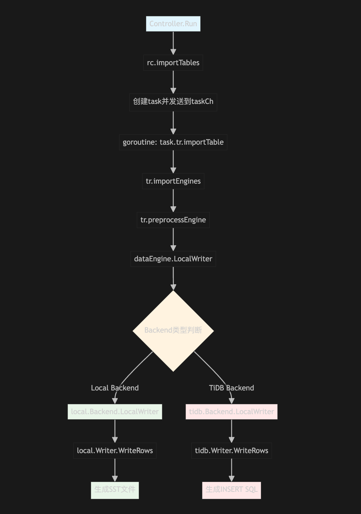

# TiDB Lightning 源码阅读

## 前言

Lightning 是 TiDB 的高速数据导入工具，专门用于将 TB 级别的数据快速导入到 TiDB 集群中。作为 TiDB 生态系统的重要组件，Lightning 在大规模数据迁移场景中发挥着至关重要的作用。

## 一、项目整体架构

### 1.1 目录结构分析

Lightning 项目位于 TiDB 仓库的 `lightning/` 目录下，整体结构清晰且模块化：

```
lightning/
├── cmd/                    # 命令行工具入口
│   ├── tidb-lightning/    # 主程序入口
│   └── tidb-lightning-ctl/ # 控制工具
├── pkg/                   # 核心功能包
│   ├── importer/         # 导入控制器
│   ├── server/           # 服务器模式
│   └── web/              # Web界面
├── tests/                # 集成测试
└── web/                  # 前端界面源码
```

核心功能主要集中在 `pkg/lightning/` 包中：

- `backend/`: 后端存储抽象层，支持多种导入模式
- `checkpoints/`: 检查点机制，用于断点续传
- `config/`: 配置管理
- `errormanager/`: 错误处理和冲突解决
- `mydump/`: 数据解析和schema处理
- `common/`: 公共工具函数

## 二、核心导入流程深入分析

### 2.1 主要导入步骤

Lightning 的导入过程被精心设计为7个有序步骤，每个步骤都有明确的职责：

```go
// 来自 import.go 中的 Run 方法
opts := []func(context.Context) error{
    rc.setGlobalVariables,    // 1. 设置全局变量
    rc.restoreSchema,         // 2. 恢复表结构
    rc.preCheckRequirements,  // 3. 预检查要求
    rc.initCheckpoint,        // 4. 初始化检查点
    rc.importTables,          // 5. 导入表数据
    rc.fullCompact,           // 6. 全量压缩
    rc.cleanCheckpoints,      // 7. 清理检查点
}
```

### 2.2 表结构恢复（restoreSchema）

`restoreSchema` 函数是导入流程的第二步，负责在目标数据库中创建所需的表结构：

**主要功能：**
1. **并发DDL执行**: 使用 `SchemaImporter` 并发创建数据库、表和视图
2. **智能重试机制**: 使用 `CREATE IF NOT EXISTS` 处理重复创建
3. **结构信息收集**: 获取创建后的表结构元信息
4. **后端适配**: 为不同后端模式准备必要的ID信息

```go
func (rc *Controller) restoreSchema(ctx context.Context) error {
    // 计算并发度，最小为4
    concurrency := max(2*rc.cfg.App.RegionConcurrency, 4)

    // 创建Schema导入器
    schemaImp := mydump.NewSchemaImporter(logger, rc.cfg.TiDB.SQLMode, rc.db, rc.store, concurrency)

    // 执行DDL导入
    err := schemaImp.Run(ctx, rc.dbMetas)

    // 获取表结构信息
    dbInfos, err := rc.preInfoGetter.GetAllTableStructures(ctx)

    // 为local backend设置数据库ID
    if isLocalBackend(rc.cfg) {
        // 获取远程数据库模型并设置ID映射
    }
    return nil
}
```

### 2.3 数据导入（importTables）



数据导入是整个流程的核心，Lightning 采用了精巧的并发控制策略：

1. **表级并发**: 多个表可以并行导入
2. **引擎级并发**: 每个表的数据被分割为多个引擎并行处理
3. **Chunk级并发**: 每个引擎内的数据块并发写入

## 三、多后端架构设计

### 3.1 Backend 接口抽象

Lightning 通过定义统一的 `Backend` 接口，Lightning 支持多种不同的数据导入策略：

```go
type Backend interface {
    Close()
    RetryImportDelay() time.Duration
    ShouldPostProcess() bool

    OpenEngine(ctx context.Context, config *EngineConfig, engineUUID uuid.UUID) error
    CloseEngine(ctx context.Context, config *EngineConfig, engineUUID uuid.UUID) error
    ImportEngine(ctx context.Context, engineUUID uuid.UUID, regionSplitSize, regionSplitKeys int64) error
    CleanupEngine(ctx context.Context, engineUUID uuid.UUID) error
    FlushEngine(ctx context.Context, engineUUID uuid.UUID) error
    FlushAllEngines(ctx context.Context) error
    LocalWriter(ctx context.Context, cfg *LocalWriterConfig, engineUUID uuid.UUID) (EngineWriter, error)
}
```

### 3.2 两种主要后端模式

```go
// 第351-445行：Backend模式选择和初始化
switch cfg.TikvImporter.Backend {
case config.BackendTiDB:
    encodingBuilder = tidb.NewEncodingBuilder()
    backendObj = tidb.NewTiDBBackend(ctx, db, cfg, errorMgr)
case config.BackendLocal:
    // Local backend初始化逻辑
    backendObj, err = local.NewBackend(ctx, tls, backendConfig, pdCli.GetServiceDiscovery())
}
```

#### 3.2.1 Local Backend
- **适用场景**: 大规模数据导入，对性能要求极高
- **实现原理**: 直接生成SST文件并通过Ingestion方式导入TiKV
- **优势**: 导入速度最快，资源占用相对较低
- **劣势**: 对集群影响较大，导入期间需要独占使用

local 模式通过本地的 KV 数据库写入数据，生成SST之后，通过 Ingestion API 将数据导入到 TiKV 中，由于数据已经整理好，
绕过了TiDB的处理且是批量写入chunk的形式，因此导入速度较快。

#### 3.2.2 TiDB Backend
- **适用场景**: 小规模数据导入，需要与现有业务共存
- **实现原理**: 通过标准SQL INSERT语句导入数据
- **优势**: 对集群影响最小，支持事务语义
- **劣势**: 导入速度相对较慢

```go
// 构建INSERT语句
func (be *tidbBackend) buildStmt(tableName string, columnNames []string) *strings.Builder {
    switch be.onDuplicate {
    case config.ReplaceOnDup:
        insertStmt.WriteString("REPLACE INTO ")
    case config.IgnoreOnDup:
        insertStmt.WriteString("INSERT IGNORE INTO ")
    case config.ErrorOnDup:
        insertStmt.WriteString("INSERT INTO ")
    }
}
```

### 3.3 引擎管理机制

Lightning 引入了"引擎"(Engine)概念来管理数据导入的生命周期：

```go
// 引擎状态转换: OpenedEngine -> ClosedEngine -> Import -> Cleanup
type OpenedEngine struct {
    engine
    tableName string
    config    *EngineConfig
}

type ClosedEngine struct {
    engine
}
```

每个引擎都有唯一的UUID，支持并发操作且状态独立管理。

## 四、检查点与容错机制

### 4.1 检查点系统设计

Lightning 的检查点系统是其可靠性的核心保障，支持任务级、表级、引擎级和Chunk级的细粒度状态管理：

```go
type CheckpointStatus uint8

const (
    CheckpointStatusMissing         CheckpointStatus = 0
    CheckpointStatusLoaded          CheckpointStatus = 30
    CheckpointStatusAllWritten      CheckpointStatus = 60
    CheckpointStatusClosed          CheckpointStatus = 90
    CheckpointStatusImported        CheckpointStatus = 120
    CheckpointStatusChecksummed     CheckpointStatus = 180
    CheckpointStatusAnalyzed        CheckpointStatus = 210
)
```

### 4.2 多层级状态追踪

1. **任务级别**: 记录整体导入进度和配置信息
2. **表级别**: 追踪每个表的导入状态和统计信息
3. **引擎级别**: 管理每个引擎的生命周期状态
4. **Chunk级别**: 精确到每个数据块的导入进度

### 4.3 断点续传实现

当Lightning异常中断后，重启时能够：
1. 从检查点数据库读取上次的进度
2. 跳过已完成的任务和数据块
3. 从中断点继续执行后续步骤

## 五、错误处理与冲突解决

### 5.1 ErrorManager 架构

Lightning 实现了完善的错误管理系统，能够处理导入过程中的各种异常情况：

```go
// 错误类型分类
const (
    syntaxErrorTableName = "syntax_error_v2"     // 语法错误
    typeErrorTableName   = "type_error_v2"       // 类型错误
    ConflictErrorTableName = "conflict_error_v4"  // 冲突错误
)
```

### 5.2 冲突检测与处理

1. **重复键检测**: 在导入过程中自动识别主键或唯一键冲突
2. **冲突策略**: 支持跳过、替换、报错等多种处理策略
3. **冲突记录**: 详细记录冲突数据，便于后续分析处理

### 5.3 错误恢复机制

- **自动重试**: 对于临时性错误自动重试
- **错误隔离**: 单个Chunk的错误不影响其他数据导入
- **详细日志**: 完整记录错误上下文信息

## 六、性能优化技术

### 6.1 并发控制策略

Lightning 采用了多层次的并发控制：

1. **表级并发**: `table-concurrency` 控制同时处理的表数量
2. **区域并发**: `region-concurrency` 控制区域操作的并发度
3. **索引并发**: `index-concurrency` 控制索引操作的并发度
4. **IO并发**: `io-concurrency` 控制磁盘IO操作的并发度

### 6.2 内存管理优化

- **连接池管理**: 动态调整数据库连接池大小
- **缓存策略**: 智能的prepared statement缓存
- **内存监控**: 实时监控内存使用，防止OOM

### 6.3 磁盘IO优化

- **批量写入**: 通过批量操作减少磁盘IO次数
- **压缩传输**: 支持KV pair压缩降低网络传输开销
- **磁盘配额**: 智能的磁盘空间管理机制
